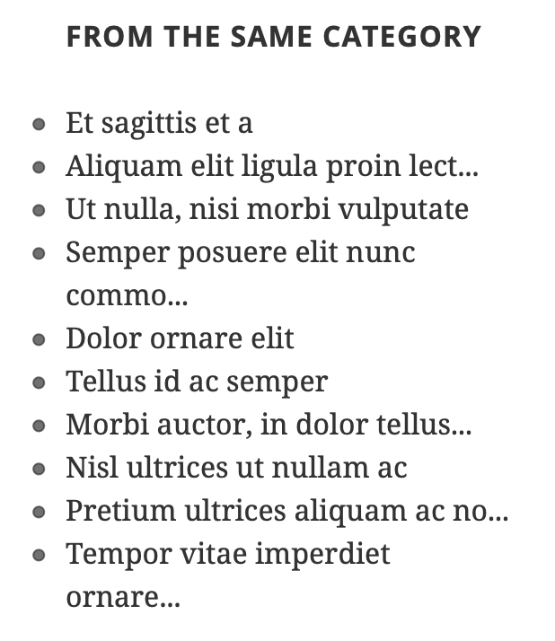

# WordPress Widget to Display Posts from Current Category

## Screenshots

| Widget settings |
| --- |
|  |

| Category page widget | Single post widget |
| --- | --- |
|  |  |

## Contributing

Check [CONTRIBUTING.md](https://github.com/gruz0/widget-to-display-posts-from-current-category/blob/master/CONTRIBUTING.md) file for more details.

## Copyright

Released under [MIT License](https://github.com/gruz0/widget-to-display-posts-from-current-category/blob/master/LICENSE)

Copyright &copy; 2013-2018 Alexander Kadyrov.
